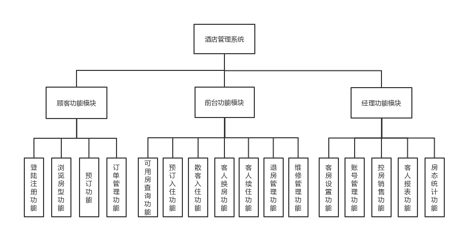
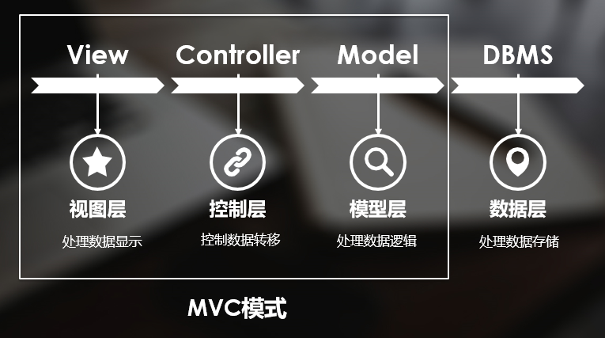
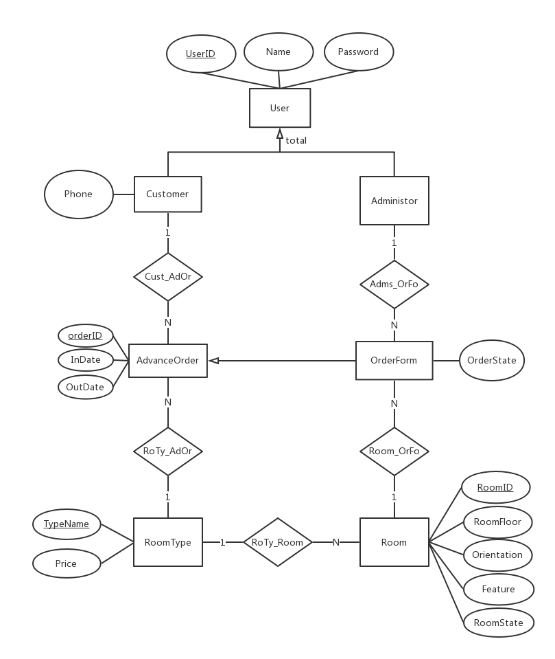
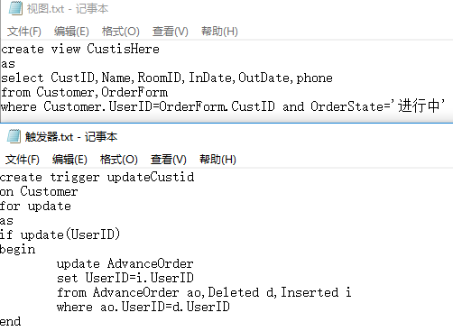

# WebHotel

## 一、概述

这是综和运用java web有关技术开发的一个酒店在线业务系统,是本人和几个朋友对有关知识的学习
总结与实践。整个系统包含基础设置、在线预订、前台管理、客房管理四种功能模块。操作角色包含
经理、前台接待员、订房客户三类角色。
基础业务流程如下图所示：

## 二、功能设计

1.基础设置:

>a)客房类型设置：设置客房分类信息：客房类型、房价、空余房间数--经理
b)客房信息设置：房间号，房间类型、楼层、朝向、房间特征描述、房间状态是否空置等--经理
c)账号设置：添加删除修改各类角色账号--经理
d)增加经理控房功能：销售旺季，为防止无计划低价销售，经理可以保留一部分房间，在适当的时候   
&ensp;再销售--经理

2.在线预订：
>a)注册与登录功能，录入身份证等个人基本信息--订房客户
>b)在线浏览房间信息：可以查询酒店房间信息，按时间搜索有效空余房间--订房客户
>c)预订：凭借身份证号在线预订空余房间，录入入住和离店日期，房价、房间类型，一旦预订将锁定   >>直至入住日。--订房客户
>d)订单管理：查看自己的所有订单信息--订房客户

3.前台管理：
>a)预订入住：根据身份证号（现场）直接调出预订单，并按客户要求(现场)如楼层、朝向等分配房间
>>直接入住。--前台接待员
>b)退房管理：将房间设置为可用，显示结账账单。--前台接待员
>c)散客入住：未预订直接入住，需要登记客人基本信息。录入入住日期和离店日期，房间号，价格等
>>入住信息。--前台接待员
>d)客人续住：可以进行续住操作，修改离店日期。--前台接待员
>e)客人换房：可以在入住后更换房间--前台接待员

4.客房管理：
>a)可用房查询：根据日期、房型查阅可用房间--前台接待员
>b)房态统计：用表格或图形显示整个酒店房间状态，可以分客房类型、楼层朝向等进行分类查询统计。
>>--经理
>c)在住客人报表：可以统计查询分析在住房客的信息。--经理
>d)维修管理：发现客房存在问题，设置故障维修，等候维修结束后，可以重新转为正常客房。--前台
>>接待员

按操作角色分类进行功能分析，则如下图所示：

## 三、技术需求

1.设计模式
>本系统采用经典的jsp+servlet+javabean的MVC设计模式，将整个系统细化为视图层、控制层、模型层、数据层
四个层次。其中，视图层由jsp负责提供页面为用户展示数据，提供相应的表单（Form）来用于用户的请求，并在适
当的时候（点击按钮）向控制器发出请求来请求模型进行更新。控制层以Serlvet为控制器，用来接收用户提交的请
求，然后获取请求中的数据，将之转换为业务模型需要的数据模型，然后调用业务模型相应的业务方法进行更新，同
时根据业务执行结果来选择要返回的视图。模型层由JavaBean作为模型，既可以作为数据模型来封装业务数据，又可
以作为业务逻辑模型来包含应用的业务操作，并与数据库进行数据的传递和读写。

2.前端
>>采用HTML+CSS+JS、EL、JSTL等技术美化界面。

3.后端
>>采用LISTENER、FILTER提高系统安全性能，运用连接池DataSource以及DAO设计模式连接数据库。

4.数据库
>>采用Microsoft SQL server2017作为DBMS存储系统数据，并灵活运用视图、触发器等数据库技术。关于数据库的详细设计请看下节。

## 四、数据库设计

>>首先，从系统整体需求分析中刻画未来数据库用户的数据需求，如顾客身份信息、客房信息、预订单信息等，并使
用实体-联系模型将数据需求转化为数据库的概念模式，如顾客实体集、客房实体集、顾客-预订单联系集等。通过进
一步分析实体-联系模型可以发现用户实体集和顾客实体集、管理员实体集之间的特化概化关系，以及各个实体集自身
拥有的属性和与其他实体集间的映射基数，包含一对多关系、一对一关系等，从而实现数据库的概念设计。我们通过
如下E-R图表示数据库的全局逻辑结构。

>>然后，依据数据库关系模式设计的理论指导进行逻辑设计，将本系统的数据库E-R图转化为关系模式，并由BCNF范
式理论进行优化，形成合适的数据库逻辑模式，使我们存储信息时避免不必要的冗余，并且可以让我们更方便的获取
信息。另外，根据用户处理的要求和基于安全性的考虑，在基本表的基础上建立在住客人报表功能的访问视图，形成
数据的外模式。同时，使用触发器避免因修改顾客ID致使预订单和酒店订单失效的异常情况。

>>最后，进行数据库的物理设计。根据DBMS特点和处理的需要，进行物理存储安排，建立索引，形成数据库内模式。
